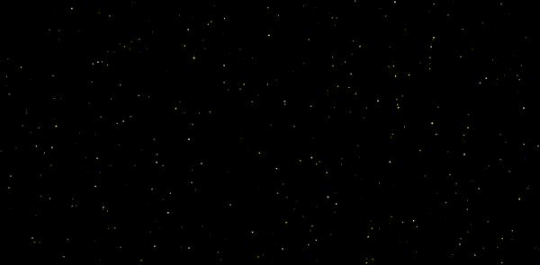

# Starfield Simulation Experiment
This project is an exploration of simulating a starfield using 2D space while creating the illusion of depth and perspective. It started as an attempt to solve a coding challenge by Daniel Shiffman, where the goal was to simulate a "starfield" effect using simple 2D shapes.

## Problem & Initial Approach
Initially, I tried simulating a starfield using two circles: a smaller central circle and a larger one surrounding it. The idea was to move the stars from the central circle outward toward the larger circle, creating an illusion of movement. However, this approach failed to convey the 3D feeling I was hoping for and didn't resemble a true Starfield simulation, as the points moved but lacked a sense of depth or perspective.
The code is in the sketch2.js file.

## Discovery of Perspective Mapping
After watching Daniel Shiffman's tutorial, I realized that I could simulate the 3D effect in 2D by leveraging the concept of perspective. By altering the z coordinate of the stars (representing their depth), I could change their size and position on the screen using the map function to create the illusion of stars moving toward the viewer.

Here’s how the code simulates perspective:

`
let sx = map((this.x / (this.z + this.epsilon) * 0.5), 0, 1, 0, width);
let sy = map((this.y / (this.z + this.epsilon) * 0.5), 0, 1, 0, height);
`

The number 0.5 in this code acts as a scaling factor. Through trial and error, I fine-tuned this value, and it helped to make the stars appear slightly more concentrated as they moved towards the viewer. 

Additionally, to create the effect that stars appear bigger when they get closer, I used the following code to adjust their size based on their z value:

`
let r = map(this.z, 0, width, 3, 0);
`

This effectively makes stars that are closer to the viewer appear larger.

## Educational Insights
Through this project, I gained a deeper understanding of how perspective works in graphics and how to use mathematical functions like map to manipulate positions and sizes based on changing parameters like depth (z). The experience also helped me grasp the importance of using visual tricks to simulate 3D effects in a 2D space, which is a core concept in many graphics-related challenges.

The process was a great learning experience, and it showed me how a few simple concepts, like the manipulation of coordinates and scaling, can create a convincing illusion of depth in a 2D world.

## Special Thanks
A big thank you to **Daniel Shiffman** for the inspiration and for creating the original coding challenge. His tutorial was a huge help in understanding how to approach this project. You can find the original challenge and code on **[Daniel Shiffman’s p5.js Editor](https://editor.p5js.org/codingtrain/sketches/4ln5hPM4Y)**.

